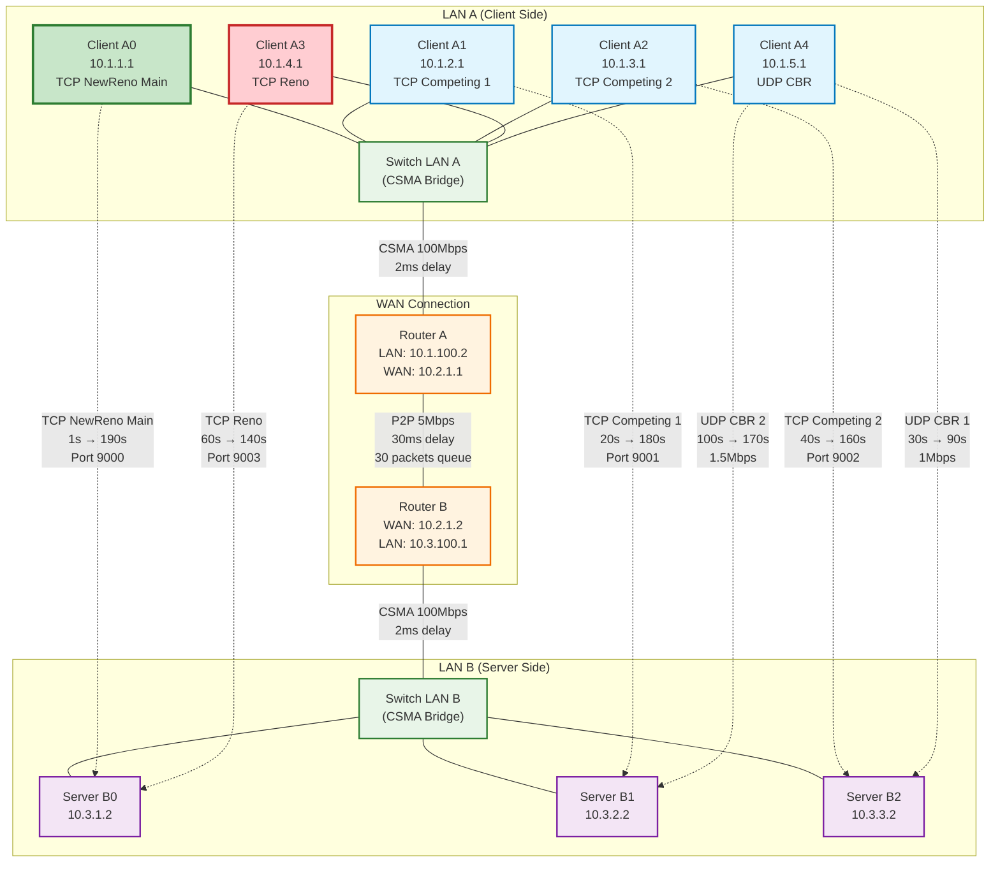
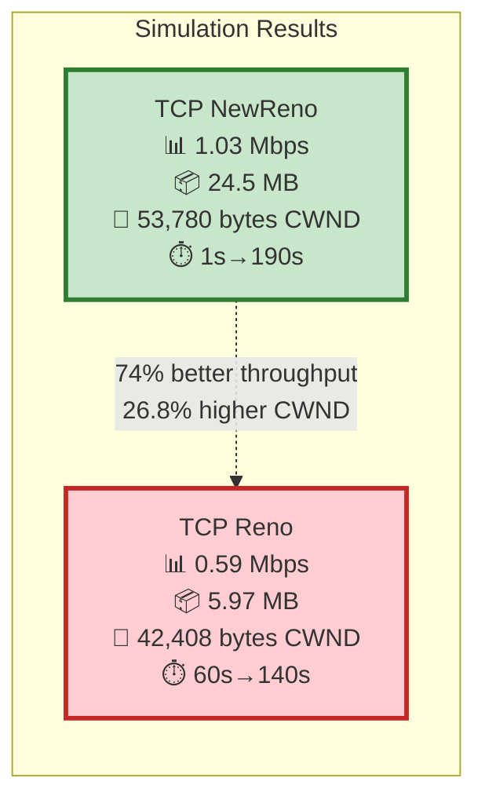

# Enterprise Network Topology Diagram

## TCP NewReno vs TCP Reno Comparison Results

## Network Configuration Details

### **📍 Network Segments:**
- **LAN A Subnets**: 
  - Client A0: 10.1.1.0/24 (TCP NewReno Main)
  - Client A1: 10.1.2.0/24 (TCP Competing 1)  
  - Client A2: 10.1.3.0/24 (TCP Competing 2)
  - Client A3: 10.1.4.0/24 (TCP Reno)
  - Client A4: 10.1.5.0/24 (UDP CBR)
- **LAN A-Router**: 10.1.100.0/24
- **WAN Link**: 10.2.1.0/24 
- **LAN B-Router**: 10.3.100.0/24
- **LAN B Subnets**: 
  - Server B0: 10.3.1.0/24
  - Server B1: 10.3.2.0/24  
  - Server B2: 10.3.3.0/24

### **🔗 Link Specifications:**
- **LAN Links (CSMA)**: 100 Mbps, 2ms delay, 100 packet queue
- **WAN Link (P2P)**: 5 Mbps, 30ms delay, 30 packet queue

### **🚀 Traffic Flows:**
1. **🟢 Main TCP NewReno**: Client A0 → Server B0 (1s-190s, Port 9000)
2. **🔴 TCP Reno**: Client A3 → Server B0 (60s-140s, Port 9003) - **NEW!**
3. **🔵 Competing TCP 1**: Client A1 → Server B1 (20s-180s, Port 9001) 
4. **🔵 Competing TCP 2**: Client A2 → Server B2 (40s-160s, Port 9002)
5. **🟡 UDP CBR 1**: Client A4 → Server B2 (30s-90s, 1 Mbps)
6. **🟡 UDP CBR 2**: Client A4 → Server B1 (100s-170s, 1.5 Mbps)

### **⚙️ TCP Configuration:**
- **NewReno Protocol**: Fast Recovery with partial ACK handling
- **Reno Protocol**: Traditional Fast Recovery
- **Segment Size**: 1448 bytes
- **Initial Congestion Window**: 10 segments
- **Features**: SACK, Window Scaling, Timestamps enabled
- **Buffer Sizes**: 131072 bytes (send/receive)

### **📊 Performance Comparison:**
- **TCP NewReno**: 1.03 Mbps average throughput, 53,780 bytes average CWND
- **TCP Reno**: 0.59 Mbps average throughput, 42,408 bytes average CWND
- **Performance Gain**: NewReno shows 74% better throughput and 26.8% higher CWND
- **Network Utilization**: 104.2% of 5Mbps WAN capacity (due to competing traffic)

### **📁 Generated Files:**
All simulation data files are saved in the `scratch/` directory:
- `enterprise-main-newreno-rx.data` / `enterprise-main-newreno-cwnd.data`
- `enterprise-reno-rx.data` / `enterprise-reno-cwnd.data`  
- `enterprise-comp1-newreno-rx.data` / `enterprise-comp1-newreno-cwnd.data`
- `enterprise-comp2-newreno-rx.data` / `enterprise-comp2-newreno-cwnd.data`
- `enterprise-udp1-rx.data` / `enterprise-udp2-rx.data`
- `enterprise-flowmon-results.xml`
- `enterprise-all-rx.data` 